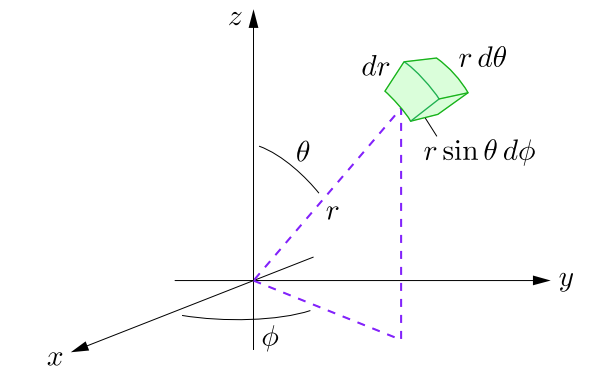

Mathematical Basics
================================

.. math:: \newcommand{\braket}[2]{\langle #1 | #2 \rangle}

The following section assumes the reader knows about the following mathematical
constructs:

1. Calculus, especially multivariable calculus
2. Linear algebra: basics of vector spaces, eigenvectors and eigenvalues
3. Real analysis: knowledge of sequences, subsequences and cauchy sequences

Hilbert Space
##################################################

Recapping from vector spaces, a vector space :math:`X` is called:

1. A *normed linear space* if for every :math:`f \in X` there is a real number 
   :math:`||f||`, called the *norm* of :math:`f`, such that 

   #. :math:`||f|| \ge 0`,
   #. :math:`||f|| = 0 \ \mathrm{iff} \ f = 0`,
   #. :math:`||cf|| = |c|||f||` for every scalar c, and
   #. :math:`||f + g|| \le ||f|| + ||g||` (Triangle Inequality)

2. An *inner product space* if for every :math:`f, g \in X` there exists a complex
   number :math:`\langle f, g \rangle` called the *inner product* of f and g, 
   such that

   #. :math:`\langle f, f \rangle` is real and greater than zero,
   #. :math:`\langle f, f \rangle = 0` if and only if :math:`f = 0`,
   #. :math:`\langle g, f \rangle = \langle f, g \rangle^*`,
   #. :math:`\langle af_1 + bf_2, g\rangle = a\langle f_1,g \rangle + b\langle f_2, g \rangle`

Note that every inner product space is a normed linear space, as each inner 
product determines a norm by the formula :math:`||f|| = \langle f, f \rangle ^{1/2}`.

As an example, consider the vector space :math:`\Bbb{R}^2`. This vector space 
has two basis vectors, :math:`\hat i` and :math:`\hat j`. The norm of any vector
:math:`\pmb{r_1} = a\hat i + b\hat j` is defined as :math:`\sqrt{a^2 + b^2}`, and the inner
product with another vector :math:`\pmb{r_2} = c\hat i + d\hat j` i.e. 
:math:`\langle \pmb{r_1}, \pmb{r_2} \rangle` is defined as the dot product, which
is :math:`ac + bd`.

Another important concept in vector spaces is that of *completeness*. If any 
convergent sequence is also a cauchy sequence in a vector space :math:`X`, then
:math:`X` is said to be *complete* 

We now come to the definition of Banach and Hilbert spaces: **A complete normed
linear space is called a Banach Space**, and **A Banach space whose norm is 
determined by an inner product is called a Hilber space**

If the above definitions went over your head, don't worry. All you need to know
about hilbert spaces is that they are vector spaces equipped with an inner product, 
and they are also complete, which allows us to use calculus techniques on 
functions defined here. Hilbert spaces are key to quantum mechanics as they 
support an infinite number of basis vectors, and also allow the definition of 
functions on the space, thereby acting as function spaces as well.

	In quantum mechanics, all wavefunctions reside in the hilbert space

Dirac (Bra-Ket) Notation
##################################################

Dirac notation is an effective way of representing states and operations in 
vector space. It consists of a *Bra* :math:`\bra{a}`, which is a map from 
:math:`V \to \Bbb{C}`, and a *Ket* :math:`\ket{b}`, which, as discussed previously
is just a vector. As a concrete example, consider 

.. math:: \ket{b} = \left( \begin{array}{c} b_1 \\ b_2 \\ . \\ . \\ . \\ b_n \end{array} \right)

and consider

.. math:: \bra{a} = \left( \begin{array}{c c c c c c} a_1 & a_2 & . & . & . & a_n \end{array} \right)

Then in dirac notation, we can define :math:`\braket{a}{b}` as 

.. math:: 

	\begin{align}
	\braket{a}{b} &= \left( \begin{array}{c c c c c c} a_1 & a_2 & . & . & . & a_n \end{array} \right) \cdot \left( \begin{array}{c} b_1 \\ b_2 \\ . \\ . \\ . \\ b_n \end{array} \right) \\
	&= a_1b_1 + a_2b_2 + ... + a_nb_n
	\end{align}

Note that every vector :math:`\ket{b}` has a corresponding dual bra :math:`\bra{b}`, 
which is defined as

.. math:: \bra{b} = \left( \begin{array}{c c c c c c} b_1^* & b_2^* & . & . & . & b_n^* \end{array} \right)

This is true, as by the definition of an inner product space :math:`\braket{b}{b} = ||b||^2`, and
:math:`\braket{b}{b} = ||b_1||^2 + ||b_2||^2 + ... + ||b_n||^2 = ||b||^2`.

This definition leads to some interesting formulae: for example,

.. math:: \braket{a}{b} = \braket{b}{a}^*

and also allows the working of operators, which are more like transformations

.. math:: \hat{T}\ket{b} = \left( \begin{array}{c c c c c} t_{11} & t_{12} & . & . & t_{1n} \\ t_{21} & t_{22} & . & . & t_{2n} \\ .&.&.& &. \\ .&.& &.&. \\ t_{n1} & t_{n2} &.&.&t_{nn} \end{array} \right) \cdot 
		  \left( \begin{array}{c} b_1 \\ b_2 \\ . \\ . \\ b_n \end{array} \right)

The question that arises now is **why don't we just use linear algebra constructs
in quantum mechanics instead of getting into Hilbert spaces?** The answer to 
that question arises when we use probability distribution functions to describe 
the state of the system rather than the system being in a finite number of 
discrete states. This is useful, as the inner product for such functions is defined
in the hilbert space as follows:

.. math:: \braket{\psi}{\psi} = \int \psi^* \psi\ d\tau

where :math:`d\tau` is the appropriate volume element.

Since hilbert spaces also include vector spaces
with a finite number of basis vectors, we can use both matrices and hilbert space
constructs while dealing with problems of this sort. The two-state system 
discussed previously is mainly dealt with using matrices, as you would have found
out if you would have visited the Wikipedia page.

Expected Values
##################################################

Deviating from hardcore quantum mechanics into statistics, the expected value
of a variable :math:`x` whose distribution is governed by a probability distribution
function :math:`P(x)` is defined by

.. math:: <x> = \sum_i x_i P(x_i)

In general, the expected value of any function of :math:`x`, :math:`Q(x)` is defined as

.. math:: <Q(x)> = \sum_i Q(x_i) P(x_i)

If the probability distribution function is continuous rather than discrete, then
the expected value becomes

.. math:: <Q(x)> = \int_a^b Q(x) P(x)\ dx

Back to quantum mechanics, by the born interpretation of the wavefunction, the 
probability distribution function is given by :math:`|\psi|^2`. Thus, if we want to 
find the expected value of an observable, suppose the expected value of the 
x-position or the expected value of energy, then we 'sandwich' the operator 
between :math:`\psi^*` and :math:`\psi` and integrate over the domain. This 'sandwich' operation
has a nice notation in bra-ket form, as shown below: if :math:`X` is an observable 
whose operator is :math:`\hat{X}`, then

.. math:: <X> = \braket{\psi|\hat{X}}{\psi} = \int \psi^* \hat{X} \psi\ d\tau

Calculus Recap
##################################################

A quick refresher if your multivariable calculus is weak (like mine): **the 
volume element varies on changing the coordinates**. If we are integrating in 
spherical coordinates, then the volume element is :math:`r^2 \sin \theta dr d\theta d\phi`, as 
shown by this diagram (credits: Daniel V Schroeder)

Also, given a radial wavefunction :math:`R(r)` which is spherically symmetric, such 
as a :math:`\mathrm{1s}` orbital, the probability distribution function is :math:`r^2 (R(r))^2`
and NOT :math:`4\pi r^2 (R(r))^2`. This is by definition; the :math:`R(r)` wavefunction
is normalized by setting :math:`\int_0^{\infty} r^2(R(r))^2 dr` to :math:`1` and finding the
normalization constant. The :math:`4\pi` factor comes in ONLY if you're doing the 
integration on :math:`\psi(x)` rather than :math:`R(x)`, so be careful here.

Another small tidbit is finding the most probable value of a variable: note that 
this is NOT equal to the expected value. The most probable value is found by
finding the maxima of the probability distribution curve; basically taking it's 
derivative and equating it to zero. This is also a source of confusion, as 
the most probable value of :math:`r` for the :math:`\mathrm{1s}` orbital is :math:`a_0`, whereas
the expected value is :math:`1.5 a_0`.

Linear algebra and the Hilbert space
##################################################

If you've been following me so far and are conversent with linear algebra, you 
must have figured out the etymology of eigenfunctions and eigenvalues; for the 
uninformed, if we have a square matrix :math:`A` and a column vector :math:`X` 
such that :math:`AX = \lambda X`, where :math:`\lambda` is a scalar, then 
:math:`X` is called the eigenvector of :math:`A`, and :math:`\lambda` is called the eigenvalue
of :math:`A`. Due to the infiniteness of the hilbert space, the eigenvector is called
the eigenfunction in hilbert space.

**Orthogonality** is another concept borrowed over from Linear Algebra: two
matrices :math:`A` and :math:`B` are mutually orthogonal if :math:`A^T B = 0`. In quantum 
mechanics, we say that two wavefunctions :math:`\psi_i` and :math:`\psi_j` are orthogonal
if

.. math:: \braket{\psi_i}{\psi_j} = \int \psi_i^* \psi_j\ d\tau = 0

Another concept borrowed from Linear algebra is **Hermiticity**: for any arbitrary
complex valued vector :math:`v` and a hermitian matrix :math:`A`, we have :math:`v^H A v = (v^H A v)^H`, 
that is the given product is real. This also extends to quantum mechanics, as 
discussed in the previous section. Also, by the `spectral theorem <https://en.wikipedia.org/wiki/Spectral_theorem>`_, 
hermitian matrices have real eigenvalues and orthogonal eigenvectors. These 
properties also extend over to quantum mechanics.

This much math provides a firm foundation for what is to follow. Other math 
concepts will be explained as and when they are required, or will be covered 
in an appendix/addendum. Note that we don't need much rigorousness in the math 
we will use: *math is to be used as a tool to solve quantum mechanical problems, 
and we should not get convoluted in the folds of mathematical rigour when using 
it as a tool*.
